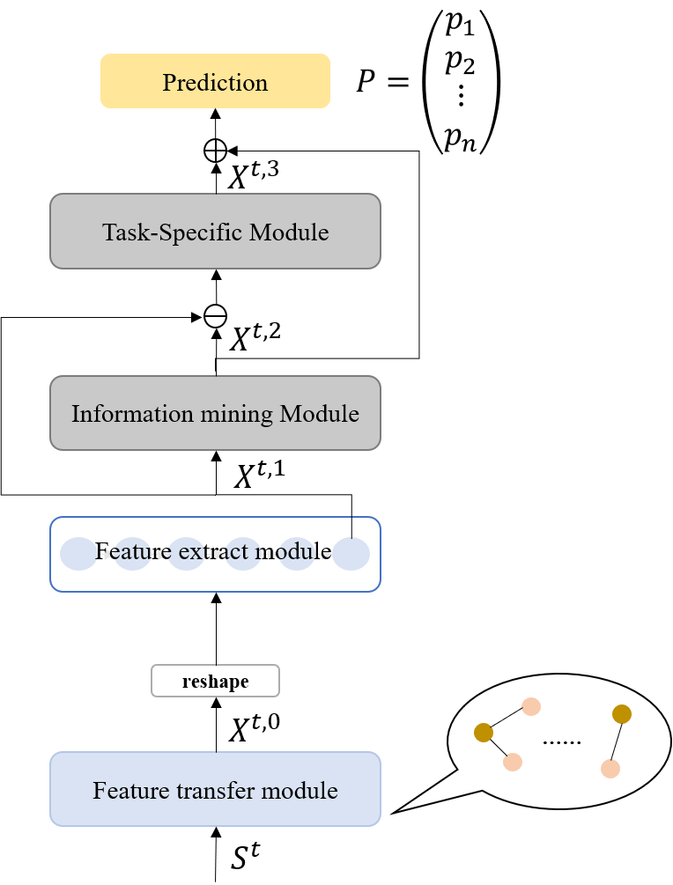

# GLHn
股票预测的目标是为了预测股票的未来趋势，提供投资者更好的投资选择。传统的股票预测
模型大多数基于时间序列模型，而最近深度神经网络在对序列建模取得了很大的成功，因此
使用深度学习进行股票预测是一个有前景的选择。但是传统的量化策略分析仅仅基于时序分
析模型，例如卡尔曼滤波器、自回归模型以及其它的扩展。具体地来说，将股票预测任务作
为一个分类问题（预测未来趋势）或者回归问题（预测未来价格）。更重要的是，并没有考
虑到股票于股票之间的相关性，而是将每支股票看作独立的个体。因此我们认为当前的主流
股价预测模型有以下缺点，仅使用个体指标，缺乏能够全面利用众多因素的能力。仅通过单
个股票的数据指标对自己的趋势进行预测，但是股票于股票之间可能存在某些关系，比如股
票 A 是股票 B 的主营业务相似，则很有可能他们之间的股价在某种程度上存在相关性。在
本文介绍的工作中，提出了一种深度学习网络（GLHn），用于进行股价预测。相比于主流的
解决方式，我们的策略有以下优势：基于股票的概念、板块以及业务信息，提出了一种计算
股票之间相关性的新算法，能够有效提取股票与股票之间预声明的概念信息，并且通过神经
网络的挖掘更深层次的隐藏联系；构建了一种新颖的网络结构，将股票之间相关信息作为共
享信息，并与每支股票的特征信息结合，来改善网络最终预测的性能；并与主流模型进行对
比，通过实验得出利用股票之间相关性的共享信息对于模型的预测效果有一定的提升。
 
